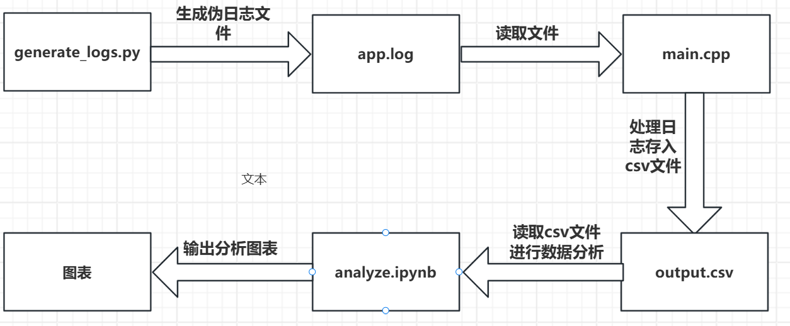
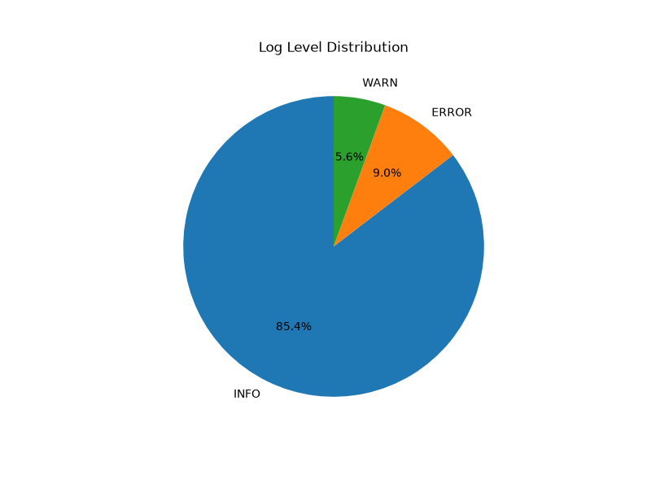
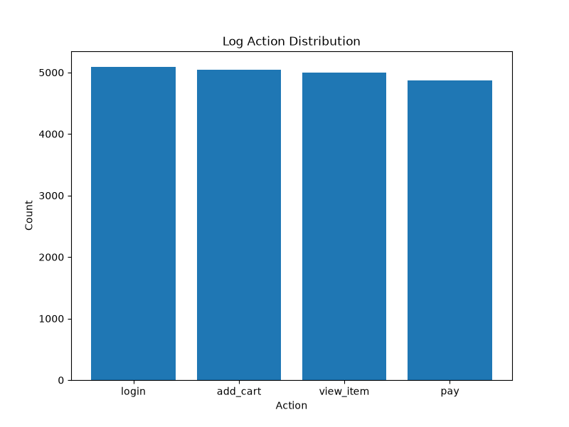
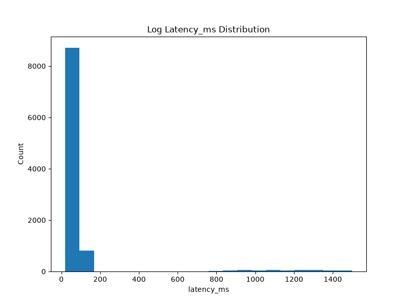
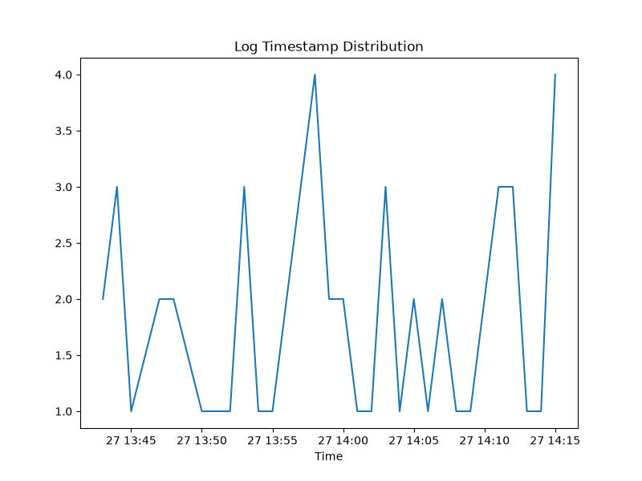

# Log Analyzer —— 轻量级日志采集与分析系统

该项目用于对 Linux 系统的日志进行采集、解析、分析，得到错误率、延迟时间等核心指标，协助系统监控与性能优化。

## 功能特性

- **C++ 高性能解析**：读取非结构化日志文件，逐行精准截取字段，存入 `vector` 容器，并转换为结构化 CSV 格式。
- **轻量级持久化**：目前数据保存在 CSV 文件内，后续计划接入 SQLite 实现更复杂的查询。
- **Python 数据分析**：利用 Pandas 进行多维度统计（如 P95 延迟、错误率），利用 Matplotlib 生成可视化图表。
- **端到端链路**：包含日志生成、采集、存储、分析、可视化的完整闭环。

## 系统架构



## 技术栈

- **核心语言**：C++、Python
- **数据处理**：Pandas、Matplotlib
- **运行环境**：Linux

## 目录结构

```text
log_analyzer 
├── Analysis                  # Python 数据分析模块
│   └── analyze.ipynb         # 包含统计与可视化的 Jupyter Notebook
│
├── Convert                   # C++ 日志解析与转换模块
│   ├── main.cpp              # 核心解析代码
│   └── main                  # 编译后的可执行文件
│
├── Data                      # 数据与图表目录
│   ├── generate_logs.py      # 日志生成脚本
│   ├── app.log               # 生成的模拟原始日志
│   ├── output.csv            # C++ 解析后输出的结构化数据
│   ├── level_pie.png         # 可视化图表：日志级别分布
│   ├── action_bar.png        # 可视化图表：动作调用统计
│   ├── latency_his.png       # 可视化图表：耗时分布直方图
│   └── timestamp_error.png   # 可视化图表：日志时间趋势
│
├── .gitignore
├── jiagou.png                # 系统架构图
└── README.md
```

## 快速开始

### 1. 生成模拟日志
```bash
    python Data/generate_logs.py
```

### 2. 编译并运行 C++ 编译器
```bash
    g++ Convert/main.cpp -o Convert/main
    ./Convert/main
```

### 3. 运行 Python 分析
```bash
    jupyter notebook Analysis/analyze.ipynb
```

## 数据展示

### 日志级别分布


### 动作调用统计


### 耗时分布


### 日志量时间趋势


## 后续计划

- 增加 SQLite 存储，支持更复杂的 SQL 查询。
- 基于滑动窗口实现异常日志的自动预警。
- 引入 C++ 多线程（生产者-消费者模型）提升海量日志解析性能。